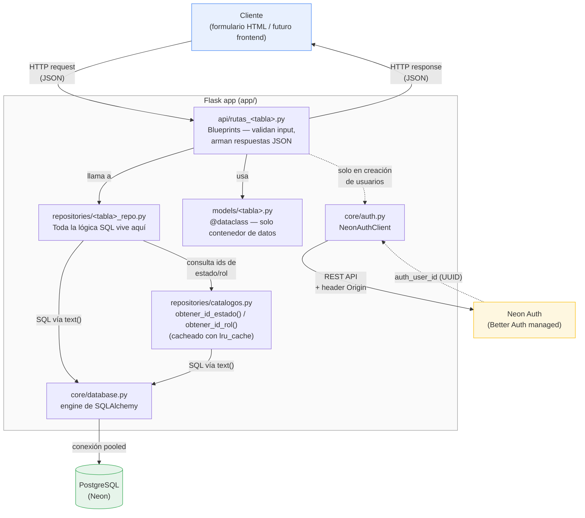

# Arquitectura del Backend — Project GMJD

Diagrama de la arquitectura en capas del backend. Está escrito en
[Mermaid](https://mermaid.js.org/), que **GitHub renderiza automáticamente** en
cualquier archivo `.md` — no necesitas exportar una imagen ni instalar nada
para verlo en el repositorio.

## Flujo general de una petición

## Qué hace cada capa

| Capa | Responsabilidad | Lo que **no** hace |
|---|---|---|
| `api/rutas_*.py` (Blueprints) | Recibe el request, valida campos requeridos, llama al repositorio correspondiente, traduce errores (`ValueError`/`IntegrityError`) a códigos HTTP | No contiene SQL |
| `models/*.py` (dataclasses) | Define la forma tipada de cada fila (`Usuario`, `Alerta`, ...) y la conversión `fila de BD → objeto` / `objeto → dict` | No tiene lógica de negocio ni SQL |
| `repositories/*_repo.py` | Todo el SQL: `listar`, `obtener`, `crear`, `actualizar`, `eliminar`, y las reglas de negocio (soft delete, paginación, validación de enums, atomicidad de operaciones como "cerrar límite anterior + crear nuevo") | No conoce Flask ni HTTP |
| `repositories/catalogos.py` | Resuelve nombres de estado/rol a sus IDs reales en cada ambiente, con caché en memoria | No expone endpoints propios |
| `core/database.py` | Engine único de SQLAlchemy compartido por todos los repos (`pool_pre_ping` para las conexiones serverless de Neon) | No ejecuta queries directamente |
| `core/auth.py` (`NeonAuthClient`) | Login de la cuenta admin técnica contra Neon Auth, creación de usuarios vía `/admin/create-user`, reintento en `401` | No toca la tabla `usuarios` de negocio (esa la maneja `usuario_repo.py`) |

## Por qué esta separación

- **Testeable por capas**: se puede probar un repositorio con una base de datos
  de prueba sin levantar Flask, o mockear el repositorio para probar una ruta
  sin tocar la base de datos real.
- **El SQL no se repite mezclado con lógica de HTTP**: cada tabla tiene un único
  lugar donde vive su SQL.
- **El contrato HTTP es estable aunque cambie la implementación interna**: la
  refactorización de `api/<tabla>/routes.py` (SQL directo) a
  `repositories/<tabla>_repo.py` (capas) no cambió ninguna URL, método ni forma
  de los JSON — el frontend/formulario no necesitó ningún cambio.

## Referencia si prefieres rehacerlo tú mismo

Si quieres editarlo o rehacerlo con otra herramienta:

- **Mermaid Live Editor**: https://mermaid.live — pega el bloque de código de
  arriba y lo puedes exportar como PNG/SVG.
- **draw.io / diagrams.net** (https://app.diagrams.net): si prefieres un
  diagrama de cajas más visual/manual en vez de código, es la alternativa más
  usada; exporta a PNG/SVG y lo puedes insertar como imagen en el README.
- **C4 Model** (https://c4model.com): si el proyecto crece y quieres un
  estándar más formal de diagramas de arquitectura (Contexto → Contenedores →
  Componentes), este es el framework de referencia — probablemente
  sobre-dimensionado para el tamaño actual del backend, pero útil si en el
  futuro se suma un frontend propio, más servicios, etc.
