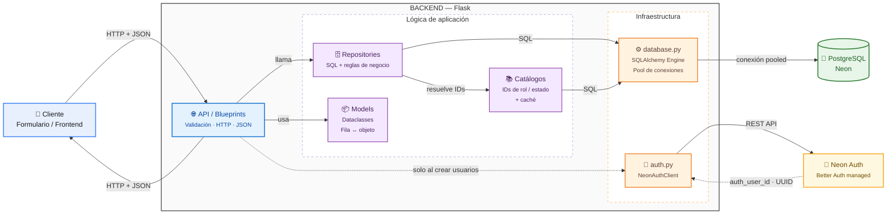

# Arquitectura del Backend — Project GMJD

Documento de referencia de cómo está armado el backend: qué capas tiene, qué
responsabilidad tiene cada una y qué reglas se repiten en todo el código.

## Diagrama general



## Flujo real de una petición (ejemplo: crear un usuario)

`POST /api/usuarios/` con `{nombre, apellido, correo, password}`:

1. **`api/rutas_usuarios.py`** recibe el JSON y valida que estén los campos
   requeridos (`nombre`, `apellido`, `correo`, `password`). Si falta alguno,
   responde `400` sin tocar ninguna otra capa.
2. La ruta llama a **`core/auth.py`** (`cliente_auth.crear_usuario(...)`),
   que crea el usuario en **Neon Auth** vía su API REST y devuelve un
   `auth_user_id` (UUID). Si Neon Auth falla, responde `502` y no se llega a
   escribir nada en la base de datos propia.
3. La ruta arma un **`models/usuario.py`** (`Usuario`, dataclass) con los
   datos recibidos.
4. La ruta llama a **`repositories/usuario_repo.py`** (`UsuarioRepository.crear`).
   El repositorio:
   - resuelve `id_rol` / `id_estado` por defecto llamando a
     **`repositories/catalogos.py`** (`obtener_id_rol("empleado")`,
     `obtener_id_estado("Activo")`) si no vinieron en el request,
   - ejecuta el `INSERT ... RETURNING` con SQLAlchemy (`text()`) sobre el
     **engine** de **`core/database.py`**,
   - devuelve el `Usuario` ya reconstruido desde la fila (`Usuario.desde_fila`).
5. Si el correo ya existe, el `INSERT` dispara `IntegrityError` y la ruta lo
   traduce a `409`.
6. La ruta serializa el `Usuario` con `.a_dict()` y responde `201` con el
   JSON al cliente.

Este mismo patrón (**ruta valida → repo resuelve catálogos y ejecuta SQL →
modelo serializa la respuesta**) se repite en las 12 rutas del proyecto.

## Estructura de carpetas

```
Backend/
├── main.py                     # entry point: app = create_app()
├── requirements.txt
└── app/
    ├── __init__.py              # create_app(): registra los 12 blueprints
    ├── core/
    │   ├── database.py          # engine de SQLAlchemy (pool_pre_ping para Neon)
    │   ├── constants.py         # nombres de estados/roles — nunca IDs hardcodeados
    │   └── auth.py               # NeonAuthClient: login admin + creación de usuarios
    ├── models/                  # una @dataclass por tabla, sin lógica
    │   ├── base.py                # ModeloBase: desde_fila() / a_dict()
    │   └── usuario.py, area.py, medicion.py, ...  (una por tabla)
    ├── repositories/            # todo el SQL vive acá, una clase por tabla
    │   ├── catalogos.py           # obtener_id_estado() / obtener_id_rol(), cacheados
    │   └── usuario_repo.py, area_repo.py, ...      (una por tabla)
    ├── api/
    │   └── rutas_<tabla>.py      # blueprints Flask: validan input, llaman al repo
    └── templates/
        └── formulario_usuario.html  # formulario de prueba para creación de usuarios
```

Cada tabla del dominio (`usuarios`, `roles`, `estados`, `areas`,
`parametros_ambientales`, `mediciones`, `limites_ambientales`, `alertas`,
`incidentes_ambientales`, `mantenimientos`, `modelos_ia`, `predicciones_ia`)
tiene su propio trío `models/<tabla>.py` + `repositories/<tabla>_repo.py` +
`api/rutas_<tabla>.py`. Ver `API.md` para el detalle de cada endpoint.

## Qué hace cada capa

| Capa | Responsabilidad | Lo que **no** hace |
|---|---|---|
| `api/rutas_*.py` (Blueprints) | Recibe el request, valida campos requeridos, llama al repositorio correspondiente, traduce errores (`ValueError`/`IntegrityError`) a códigos HTTP | No contiene SQL |
| `models/*.py` (dataclasses) | Define la forma tipada de cada fila (`Usuario`, `Alerta`, ...) y la conversión `fila de BD → objeto` / `objeto → dict` vía `ModeloBase` | No tiene lógica de negocio ni SQL |
| `repositories/*_repo.py` | Todo el SQL: `listar`, `obtener`, `crear`, `actualizar`, `eliminar`, y las reglas de negocio (soft delete, paginación, validación de enums, atomicidad de operaciones como "cerrar límite anterior + crear nuevo") | No conoce Flask ni HTTP |
| `repositories/catalogos.py` | Resuelve nombres de estado/rol a sus IDs reales en cada ambiente, con caché en memoria (`lru_cache`) | No expone endpoints propios |
| `core/database.py` | Engine único de SQLAlchemy compartido por todos los repos (`pool_pre_ping` para las conexiones serverless de Neon) | No ejecuta queries directamente |
| `core/constants.py` | Nombres canónicos de estados y roles (`"Activo"`, `"empleado"`, ...) usados por los repos para pedirle el ID a `catalogos.py` | No define IDs numéricos fijos |
| `core/auth.py` (`NeonAuthClient`) | Login de la cuenta admin técnica contra Neon Auth, creación de usuarios vía `/admin/create-user`, reintento automático si la sesión admin expiró (`401`) | No toca la tabla `usuarios` de negocio (esa la maneja `usuario_repo.py`) |

## Convenciones que se repiten en todos los repositorios

- **Sin ORM**: todo el SQL se escribe explícito con `sqlalchemy.text()`, no hay
  modelos declarativos ni migraciones automáticas.
- **`con.execute(...).mappings()`** para leer filas como diccionarios y
  poder convertirlas a dataclass con `Modelo.desde_fila(fila)`.
- **`engine.begin()`** en vez de `engine.connect()` para cualquier operación
  que escribe (`crear`, `actualizar`, `eliminar`): abre una transacción y
  hace commit/rollback automático.
- **Nunca se hardcodea el ID de un estado o un rol**: siempre se pide por
  nombre a `catalogos.py` (`obtener_id_estado(NOMBRE_ESTADO_ACTIVO)`), para
  que los IDs puedan diferir entre entornos (dev/prod) sin romper el código.

### Estrategia de borrado, según el tipo de tabla

No todas las tablas se borran igual — cada repositorio implementa la que le
corresponde a su tipo de dato:

| Tipo de tabla | Estrategia | Tablas |
|---|---|---|
| Entidad con ciclo de vida | Soft delete vía `id_estado` (pasa a `"Eliminado"`) | `usuarios`, `areas`, `alertas`, `incidentes_ambientales`, `modelos_ia` |
| Histórico / versionado temporal | Se cierra con `fecha_fin`, nunca se borra la fila | `limites_ambientales` |
| Log append-only | No se borra ni se actualiza, solo se inserta | `mediciones`, `predicciones_ia`, `mantenimientos` |
| Catálogo | `DELETE` real, con validación de llaves foráneas | `roles`, `estados`, `parametros_ambientales` |

## Por qué esta separación

- **Testeable por capas**: se puede probar un repositorio con una base de
  datos de prueba sin levantar Flask, o mockear el repositorio para probar
  una ruta sin tocar la base de datos real.
- **El SQL no se repite mezclado con lógica de HTTP**: cada tabla tiene un
  único lugar donde vive su SQL.
- **El contrato HTTP es estable aunque cambie la implementación interna**: la
  refactorización de SQL directo en las rutas a `repositories/<tabla>_repo.py`
  (capas) no cambió ninguna URL, método ni forma de los JSON — el
  frontend/formulario no necesitó ningún cambio.
